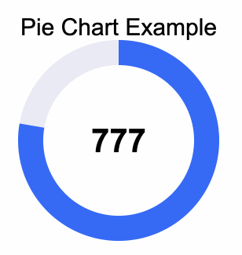

#  Pie Chart Example

## Demo link [here](https://kennyfully88.github.io/pie_chart_example/)

An example of a pie chart.



## How to use this widget

1. Copy the pie_chart folder into your project

2. Add the following widget;

```dart
PieChart(
    title: 'Pie Chart Example', // Optional title property
    value: 777.0, // The current value
    maxValue: 1000.0, // The max value
),

// Make sure always have the maxValue greater than the current value
// Failure to do so may cause a bug
```

3. If the widget didn't auto import make sure to import pie_chart.dart

---

## Questions? Requests?

If you have any questions and/or requests feel free to contact me on

LinkedIn: [Kenny Fully](https://www.linkedin.com/in/kennyfully/)

Twitter: [Kenny Fully](https://twitter.com/kennyfully)
